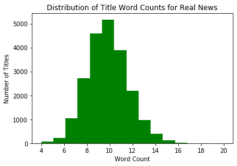
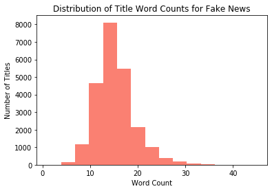
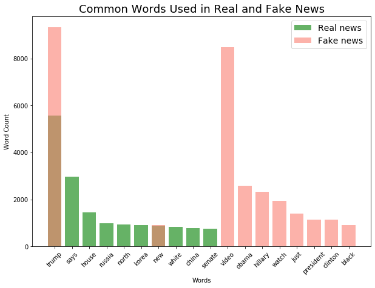

# Real or Fake News

## The Kaggle Competition

This [Kaggle Competition](https://www.kaggle.com/clmentbisaillon/fake-and-real-news-dataset) was created by Clement Bisaillon.  It is a great way to work with NLP to train your model to spot real or fake news.

## What is in this repo?

| Files | Description |
|-|-|
| `true.csv` | dataset containing real news |
| `fake.csv` | dataset containing fake news |
| `real_or_fake.ipynb` | Jupyter notebook containing data cleaning steps and models |

## Data Dictionary

The data consisted of two data sets -- fake and real .csv files each with 23481 rows and 21417 rows of data respectively.  Each of these files contained fake news titles and body texts.

| Columns | Description |
|-|-|
| title | The title of the article in question |
| text | The body of the article |
| subject| Category of news |
| date| Date that the article was written |
| title_word_count | Number of words in the title |
| category | Real = 1 ; Fake = 0 |
| weekday | The day of the week |

## Overall Thoughts

During our exploratory phase, we hypothesized that usually when people are lying, they tend to talk a lot more -- and therefore, write a lot more.  So we looked through the distribution of word counts.  And sure enough, the number of word counts for fake news is more than the number of word counts for real news just in the title column alone (as shown below).

Then we took a look at the differences between common words found.  The only two words that both real and fake news share is 'Trump' and 'new' with 'Trump' being much higher than usual in fake news.

During our modeling phase, we wanted to use our prior knowledge from [Project 3](https://git.generalassemb.ly/jennyinc777/project_3/tree/working) to our advantage.  We knew that our tried-and-true logistic regression worked well for that dataset.  So we put that to the test.  Unsurprisingly, it was our best performer with a test score of 0.9660 when used with the `PorterStemmer()`.

## Conclusions

| Estimators/Classifiers | Model 1 | Model 2 | Model 3 | Model 4 | Model 5 |
|-|:-:|:-:|:-:|:-:|:-:|
| `PorterStemmer()` | X |  |  | X | X |
| `CountVectorizer()` | X | X |  |  |  |
| `TfidfVectorizer()` |  |  | X | X | X |
| `LogisticRegression()` | X | X | X | X |  |
| `RandomForestClassifier()` |  |  |  |  | X |
| Train Score: | 0.9849 | 0.9840 | 0.9505 | 0.9563 | 0.9504 |
| Test Score: | **0.9660** | 0.9529 | 0.9588 | 0.9643 | 0.9623 |

**Hyperparameters used in best score:**

| Estimator/Transformer | Hyperparameter | Set to: |
|-|-|-|
| `CountVectorizer()` | `stop_words` | `english` |
| `LogisticRegression()` | `max_iter` | 1000 |
| `LogisticRegression()` | `solver` | `liblinear` |
